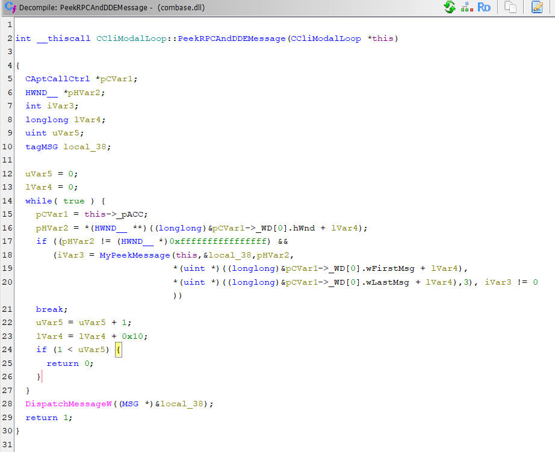
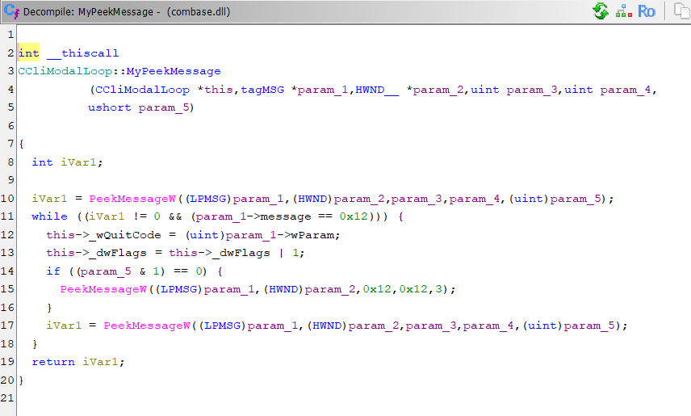

# What the COM STA deadlock has in store for us

I find it hard to judge the practical value of this article, since these days I'm pretty far removed from .NET application development. It was written more as a research exercise - excavating a fossilized, ahem, mammoth - and maybe some practicing programmer will find it amusing.

Out in the wild I couldn't find any mention of this problem; only researcher Joe Duffy [touched on it](https://joeduffyblog.com/2006/02/23/stas-pumping-and-the-ui/) in passing on his blog. There was also an indirect [mention](https://groups.google.com/g/microsoft.public.platformsdk.com_ole/c/J1DSTILGIqM/m/dO-hLDc_olEJ?hl=en&pli=1) on this Google group. The absence of any references to this phenomenon probably points to the near-zero value of the research - but the article won't write itself.

We're going to talk about a very unusual cause of a GUI-thread deadlock in .NET windowed applications - WinForms and WPF. When such an app hangs dead, the developer looks for the cause where they're used to looking: in their own locks, in a race between their own threads, in a bad `lock` or a forgotten `.Wait()`. They turn their code inside out - and often find nothing incriminating. Because the cause lies not one floor below where they're looking, and not even in the basement: it's in a mechanism they didn't write, can't see, and - as it seems to them - don't work with at all.

If you work with WinForms/WPF, you surely know that the entire GUI stack is built on COM's single-threaded model - Single-threaded apartments: the clipboard, drag-and-drop, common dialogs, shell integration, OLE - all of these are STA components.

In WinForms, the generated `Main` entry point has an explicit `[STAThread]` attribute (you can see it right in the template); in WPF the entry point is generated automatically and also carries the `[STAThread]` attribute.

And it's precisely this model - or rather, that very single-threaded apartment (STA) with its window-message processing - on which the GUI thread of every WinForms and WPF application quietly stands. A deadlock that looks like an async/await bug is, in reality, a thirty-year-old COM machine stalled under the hood.

What is COM hiding behind its implementation of the single-threaded STA model? As it turned out, the crux was buried in a rather interesting spot.

Absolutely any call to `CoInitializeEx()` entails the creation of an invisible window with the class "OleMainThreadWndClass". You'd think - why would COM create windows, let alone work with them? Historically, here's how it went. First came OLE 1.0 (early '90s) - compound documents - and its inter-process communication (IPC) mechanism was built literally on DDE - Dynamic Data Exchange - that is, on window messages (`WM_DDE_*`), which let one program request data from another. Then, for OLE 2.0 in 1993, Microsoft rewrote everything onto a new object layer - COM - replacing DDE with proper (*curious in what sense it's "proper" - my note*) marshaling. And for backward compatibility with OLE components, they kept the window machinery in COM. And yes, jumping ahead: somewhere very deep in COM's guts sits DDE-message handling from the early '90s.

But first things first.

The `CoInitializeEx()` call activates the API chain `ThreadFirstInitialize() -> RegisterOleWndClass()`, which, as I wrote, creates the hidden window with the class "OleMainThreadWndClass". Inside `OleMainThreadWndProc` I found surprisingly little. I expected to see a call dispatcher. But it wasn't there - the procedure itself exists, but there's no dispatching in it: inside, it handles only three kinds of messages. For `WM_CLOSE` and `WM_DESTROY` the procedure merely writes a trace and returns zero - the window isn't even torn down; it all comes down to logging and lifetime protection. For the private `WM_USER+5` it returns a pointer to the apartment's host object via `GetSingleThreadedHost`. Everything else goes to `DefWindowProcW`. And that's it. A dead end.

Fine, let's come at it from the other side. In Ghidra I disassembled what an STA thread actually calls when it's in a waiting state: the function `CoWaitForMultipleHandles`. And it all came together: `CoWaitForMultipleHandles()` calls `ClassicSTAThreadWaitForHandles()`, which in turn spins up a "client" modal loop `CCliModalLoop::BlockFn()`, where you can see the calls:

- `InitChannelIfNecessary` - this API brings up the RPC channel: the incoming call travels over LPC, not "as a window message";
- the `MsgWaitForMultipleObjectsEx` API - we sleep until a handle is signaled or a message arrives in the queue (!);
- `PeekRPCAndDDEMessage` pulls precisely the RPC and DDE messages out of the queue.

So we have: the call arrives over LPC, but its delivery is **woven into the message queue**, and the modal loop fishes it out while the thread waits.

I thought this was rock bottom, but then someone knocked from below.

The `PeekRPCAndDDEMessage` call, through the wrapper `CCliModalLoop::MyPeekMessage`, invokes `PeekMessageW` (`PM_REMOVE`) + `DispatchMessageW` - exactly the same two calls as in any textbook `while (GetMessage()) DispatchMessage()` of any GUI.

So where's the catch, you ask?

This `PeekMessage`/`DispatchMessage` loop - you're used to thinking of it as "yours," your own: it drives the handling of clicks, repaints, input. And it's the same loop by which COM delivers incoming calls and async delivers its continuations.

One queue, one thread, one pair of calls for all of them. And - two traps, both arising from the fact that the message loop is shared.

Block it with `.Result`, `.Wait()`, `lock`, a heavy computation - and you haven't just "frozen the UI for a second," you've stopped the only mechanism by which the very result you're waiting for would reach you; you wait for an answer on a channel you yourself muted.

Run the message loop where you shouldn't - `Application.DoEvents()`, a modal dialog, `MessageBox`, or even a plain `await` - and the loop, in the middle of your code, pulls the next message out of the queue and dispatches it. Your handler re-enters while the first one is still on the stack: a click on top of a click, a timer on top of a handler, a COM callback on top of a method. And off it goes…

The same two calls taught in the first lesson of Win32 turn out, under the hood, to be the transport for both COM and async - somewhere in that fossilized, 30-year-old OLE legacy, in the plain handling of window messages that at first glance looks so harmless.

What does this mean in practice?

You don't need to "work with COM" to run into a COM STA deadlock. If you're on a .NET UI thread - you're already on a COM STA. And an STA thread is obliged to process its message queue continuously; the moment it blocks, processing stops, and the incoming call isn't delivered.

What to do?

Don't park the UI thread on an asynchronous operation or heavy computation. Its one job that must not be interrupted is to keep the message loop turning. And how to do that - that's up to you.
