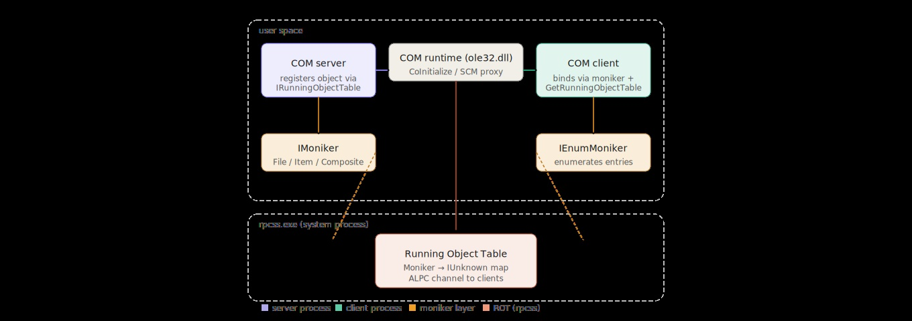

**Inside the Running Object Table: COM's Hidden Registry of Live Objects**

**Introduction:** Running Object Table, part I

COM is one of those technologies you think you understand until you start asking inconvenient questions, just some like: "Huhmmm... what the hell is that". Most developers know the basics — interfaces, CoCreateInstance, reference counting — but COM has always carried more infrastructure than its public API suggests. One of the least-examined pieces of that infrastructure is the **Running Object Table**, or ROT.
The ROT is a system-wide registry of live COM objects. Aint classes or factories — actual instantiated objects that have explicitly announced themselves as running and reachable. Think of it as the difference between a phone book and a list of people who are currently answering their phones. When a COM server wants to say "I'm here, find me by this name", it registers a moniker in the ROT. When a client wants to bind to something that's already running — rather than spinning up a new instance — it looks there first.
This matters more than it sounds. The ROT is the mechanism behind GetObject() in VBScript, the reason Visual Studio exposes its automation object to external scripts, and the reason certain IPC patterns in Windows work without any explicit socket or pipe setup. It is also, as let's see, a surface that is easy to misunderstand and occasionally to abuse.
In this post i'll try to explore the ROT from the ground up — in C, without ATL, without MFC, without training wheels. We'll enumerate what's actually registered on a live Windows system, decode the monikers i find, and talk about what the results reveal about COM's runtime model.

